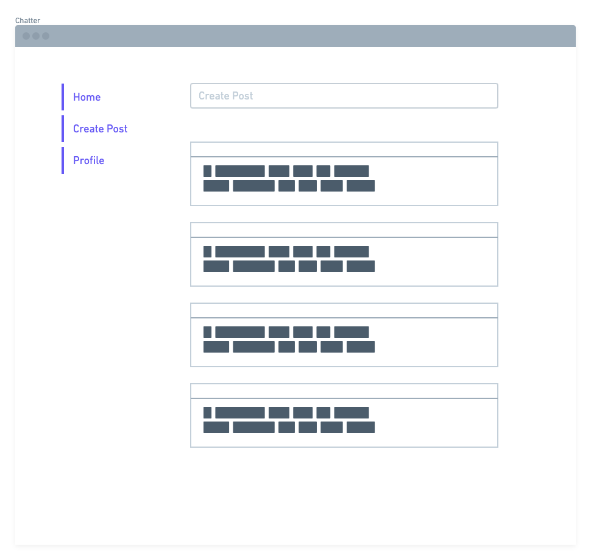
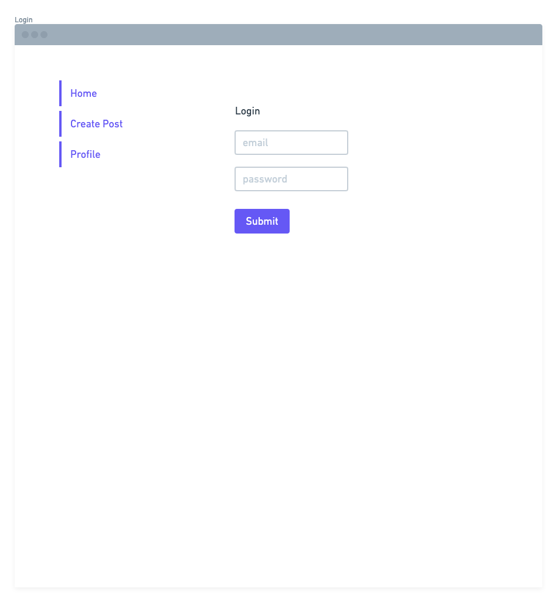
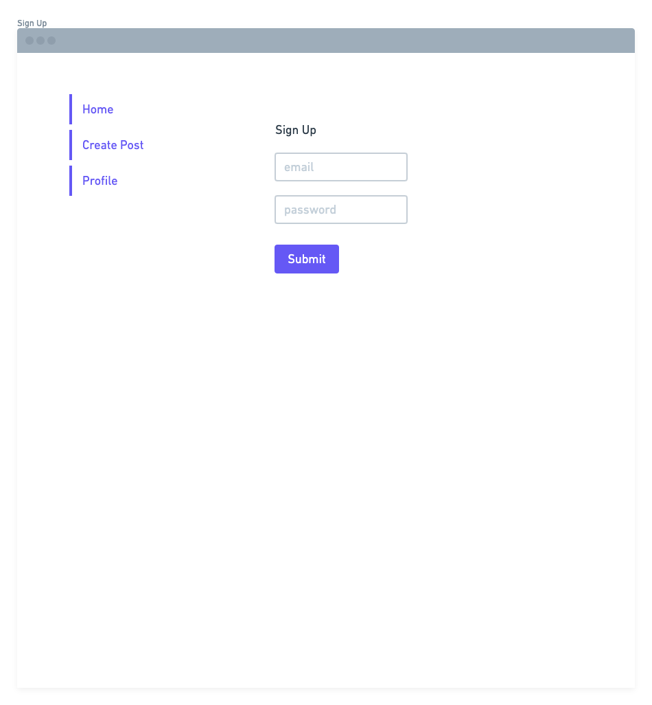
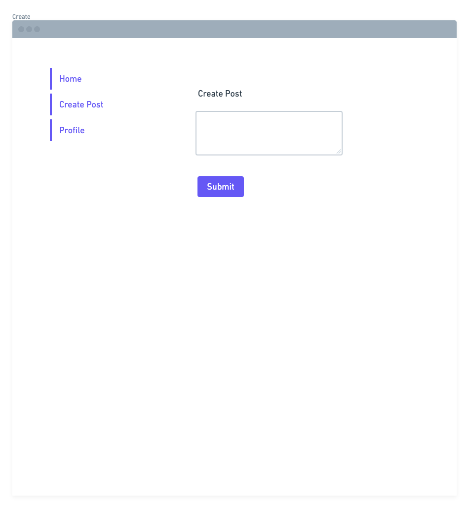
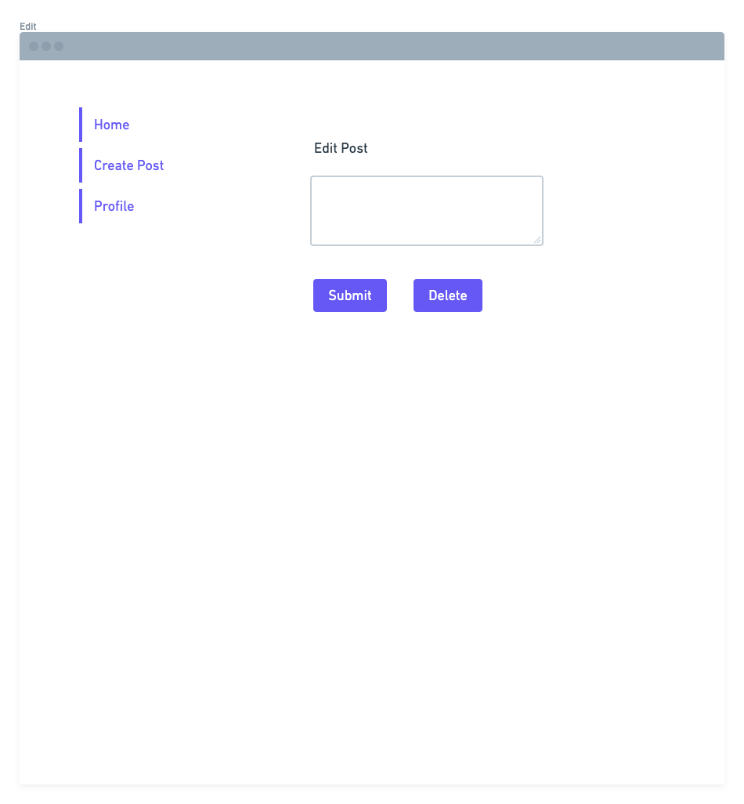
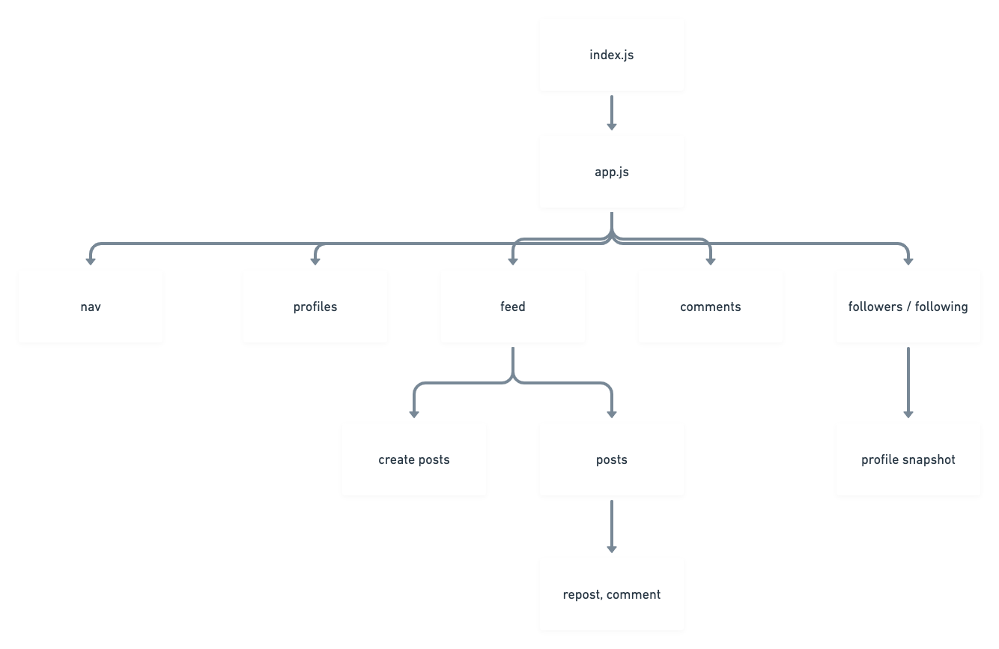
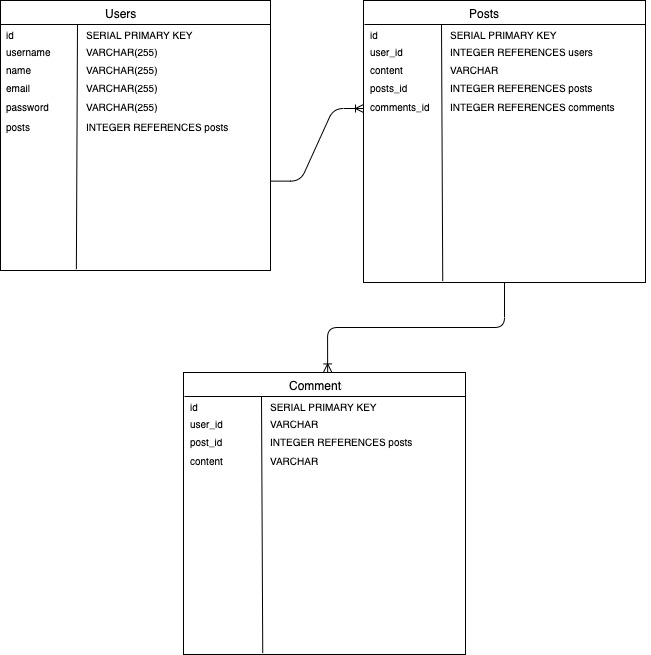

# Chatter App

- [Overview](#overview)
- [MVP](#mvp)
  - [Goals](#goals)
  - [Libraries and Dependencies](#libraries-and-dependencies)
  - [Client (Front End)](#client-front-end)
    - [Wireframes](#wireframes)
    - [Component Tree](#component-tree)
    - [Component Hierarchy](#component-hierarchy)
    - [Component Breakdown](#component-breakdown)
    - [Time Estimates](#time-estimates)
  - [Server (Back End)](#server-back-end)
    - [ERD Model](#erd-model)
- [Post-MVP](#post-mvp)
- [Code Showcase](#code-showcase)
- [Code Issues & Resolutions](#code-issues--resolutions)

<br>

## Overview

**Chatter** is a Twitter clone built on a Ruby on Rails backend and React front end.

<br>

## MVP

The MVP for **Chatter** will feature user creation, authentication, the ability to create, favorite, comment on, and repost posts, and follow users.

<br>

### Goals

- _User CRUD_
- _Posts CRUD_

<br>

### Libraries and Dependencies

|    Library    | Description                                          |
| :-----------: | :--------------------------------------------------- |
|     React     | _Library for building front end interfaces with JSX_ |
| React Router  | _Library for simulating route changes in React apps_ |
|  Material UI  | _Component library for interface styling_            |
|     Sass      | _CSS with added functionality_                       |
| Ruby on Rails | _Framework for building back ends with Ruby_         |
|    bcrypt     | _Library for hashing passwords_                      |
|      JWT      | _Library for creating tokens_                        |

<br>

### Client (Front End)

#### Wireframes



- Homepage



- Signin



- Signup



- Create



- Edit

#### Component Tree



#### Component Hierarchy

```structure

src
|__ proposal/
|__ services/
      |__ apiConfig.js
      |__ auth.js
      |__ users.js
      |__ posts.js
|__ components/
      |__ nav/
            |__ nav.component.jsx
            |__ nav.styles.scss
      |__ post/
            |__ post.component.jsx
            |__ post.styles.scss
|__ screens/
      |__ homepage/
            |__ homepage.component.jsx
            |__ homepage.styles.scss
      |__ signin/
            |__ signin.component.jsx
            |__ signin.styles.scss
      |__ signup/
            |__ signup.component.jsx
            |__ signup.styles.scss
      |__ posts/
            |__ posts.component.jsx
            |__ posts.styles.scss

```

#### Component Breakdown

| Component |    Type    | state | props | Description                      |
| :-------: | :--------: | :---: | :---: | :------------------------------- |
|    Nav    | functional |   y   |   n   | _Nav will link to other screens_ |
|   Post    | functional |   n   |   y   | _Create posts_                   |
| Comments  | functional |   n   |   y   | _Comment on posts_               |
| Messages  | functional |   n   |   y   | _Send messages_                  |
|  Profile  | functional |   n   |   y   | _See your profile_               |
|   Feed    | functional |   n   |   y   | _See posts from following_       |

#### Time Estimates

| Task      | Priority | Estimated Time | Time Invested | Actual Time |
| --------- | :------: | :------------: | :-----------: | :---------: |
| HTML      |    L     |      1 hr      |     0 hrs     |    0 hrs    |
| Styling   |    L     |     16 hrs     |     0 hrs     |    0 hrs    |
| Front End |    L     |     32 hrs     |     0 hrs     |    0 hrs    |
| Back End  |    L     |     16 hrs     |     0 hrs     |    0 hrs    |
| TOTAL     |          |     65 hrs     |     0 hrs     |     TBD     |

<br>

### Server (Back End)

#### ERD Model



<br>

---

## Post-MVP

- Ability to follow other users
- Follower feed
- View trending posts

---

## Code Showcase

> Use this section to include a brief code snippet of functionality that you are proud of and a brief description.

## Code Issues & Resolutions

> Use this section to list of all major issues encountered and their resolution.
